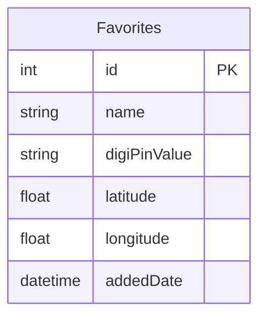

# 🚀 DigiPin-Finder

<p align="center"></p>

## Short Description
DigiPin-Finder is an innovative Android application designed to streamline how you discover, manage, and interact with "DigiPins"—digital markers often encoded in QR codes or associated with specific locations. Scan, find, save, and navigate your essential digital waypoints with unparalleled ease.

## ✨ Key Features
*   **📸 QR Code Scanning:** Instantly capture and interpret DigiPins from any QR code, transforming physical data into actionable digital information.
*   **📍 Pin Discovery & Search:** Effortlessly find and explore DigiPins based on their unique identifiers or location data, ensuring you're always connected to the right information.
*   **❤️ Favorites Management:** Save and organize your most important DigiPins in a personalized collection for quick and easy access anytime, anywhere.
*   **🗺️ Integrated Navigation:** Seamlessly transition from a discovered DigiPin to navigation, guiding you directly to your desired location.
*   **Intuitive & Modern UI:** Crafted with Jetpack Compose for a beautiful, responsive, and delightful user experience on Android.
*   **🔒 Local Persistence:** Your favorited DigiPins are securely stored locally using Room Database, ensuring your data is always available offline.

## Who is this for?
DigiPin-Finder is for anyone who frequently interacts with QR codes or digital location markers and seeks a smarter way to manage them.
*   **Event Attendees:** Quickly scan and save session details, speaker info, or booth locations.
*   **Travelers & Explorers:** Discover and bookmark points of interest, hidden gems, or essential travel information.
*   **Logistics & Field Workers:** Manage and navigate to specific digital assets or work sites.
*   **Everyday Users:** Keep track of digital coupons, product information, or contact details shared via QR codes.

## Technology Stack & Architecture
*   **Platform:** Android Native
*   **Language:** Kotlin
*   **UI Framework:** Jetpack Compose (Modern Android UI Toolkit)
*   **Database:** Room Persistence Library
*   **Build System:** Gradle (Kotlin DSL)
*   **Architecture:** Follows modern Android best practices, leveraging MVVM principles for clear separation of concerns.

## 📊 Architecture & Database Schema

The application employs a clean architecture with a focus on data persistence for user favorites. The core data model, `Favorites`, is managed efficiently via Room Persistence Library.



## ⚡ Quick Start Guide

To get DigiPin-Finder up and running on your local machine:

1.  **Clone the Repository:**
    ```bash
    git clone https://github.com/ManavPatni/DigiPin-Finder.git
    cd DigiPin-Finder
    ```
2.  **Open in Android Studio:**
    Launch Android Studio and open the cloned project.
3.  **Sync Gradle:**
    Allow Android Studio to sync the project with its Gradle files. This will download all necessary dependencies.
4.  **Run the Application:**
    Select the `app` module and run it on your preferred Android emulator or a physical device.

## 📜 License
This project is licensed under the MIT License. See the `LICENSE` file for more details.